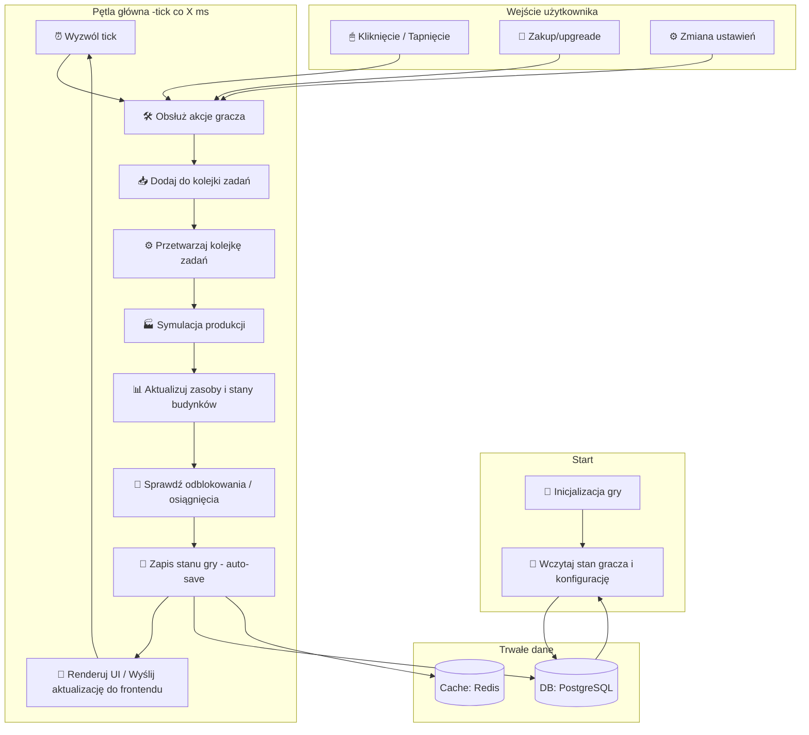

### Krótki opis kroków

1. **Inicjalizacja gry**

   * Załaduj konfiguracje fabryk, template’y budynków i mapę gry.
   * Spróbuj odtworzyć ostatni zapis gracza.

2. **Obsługa wejścia gracza**

   * Kliknięcia w UI (budowa nowego modułu, przyspieszenie produkcji itp.) są zamieniane na “zadania” i wrzucane do kolejki.

3. **Przetwarzanie kolejki zadań**

   * Kolejka asynchronicznie rozdziela zadania: budowa, badania, zakupy.

4. **Symulacja produkcji**

   * Na każdy „tick” obliczaj ile surowców wyprodukowano w poszczególnych modułach (biorąc pod uwagę ulepszenia, multiplikatory, limity magazynowe).

5. **Aktualizacja stanów**

   * Zwiększaj zasoby, aktualizuj stan budynków (np. czas do ukończenia produkcji kolejnego przedmiotu).

6. **Sprawdzanie odblokowań i osiągnięć**

   * Jeśli gracz spełni warunki (np. wyprodukuje X przedmiotów), przyznaj osiągnięcie lub odblokuj nowe technologie.

7. **Auto-zapis**

   * Co ustalony czas (np. co minutę) zapisuj stan gry do bazy i cache’u, by zabezpieczyć przed utratą postępów.

8. **Renderowanie**

   * Wyślij do frontend komponentów dane o stanie gry (JSON przez REST/GraphQL lub WebSocket), a UI odświeży wykresy i panele produkcji.

